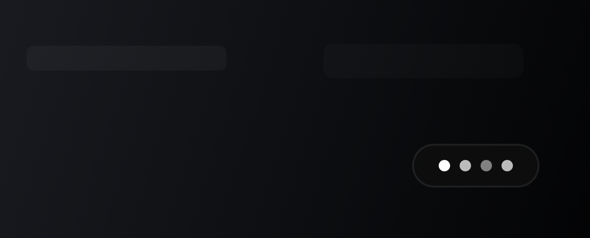
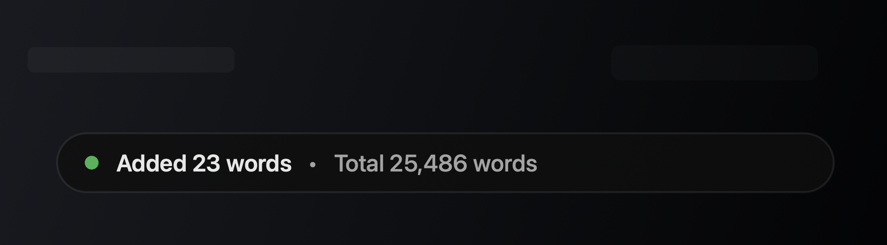
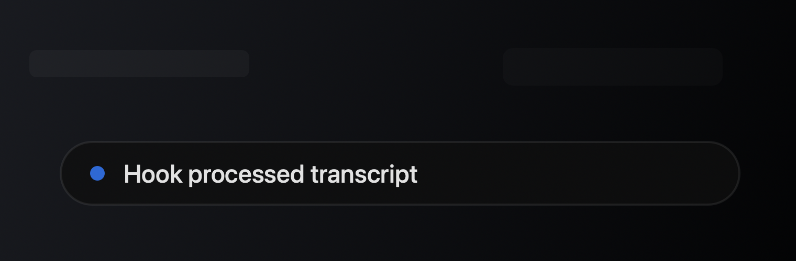

# Codex Dictation Hooks

Automation hooks for Codex dictation on Windows and macOS. The watcher reads new Codex dictation transcripts, optionally rewrites them with a cheap/low-effort Codex agent hook, then sends the final text to the clipboard or to a custom local action.

This is a Windows-focused fork of [`hcassar93/codex-dictation-hooks`](https://github.com/hcassar93/codex-dictation-hooks). The upstream project is macOS-first and MIT-licensed. This fork preserves the macOS LaunchAgent/HUD behavior and adds Windows support, a one-command Windows installer, diagnostics, and bilingual French/English hook examples.

## Fork scope

The original macOS behavior remains part of this fork:

- `./bin/codex-dictation-hooks install` still installs a macOS LaunchAgent.
- The native Swift HUD source and screenshots are retained.
- macOS still uses `pbcopy` by default.

The Windows layer is added on top:

- `bin/codex-dictation-hooks.ps1` and `.cmd` wrappers;
- a Node.js cross-platform core shared by Windows and macOS;
- Windows clipboard support through `Set-Clipboard`;
- manual current-session watcher start/stop without logon autostart;
- a small Windows status/history HUD for copied text, word tally, and the last five processed dictations;
- `doctor` diagnostics;
- low-cost Codex hook examples for English and French dictation workflows.

## What it does

Codex stores global dictation history at:

```text
~/.codex/transcription-history.jsonl
```

This tool watches that JSONL file for new transcript entries. For each transcript it:

1. checks whether a configured trigger phrase matches;
2. runs the matching deterministic hook, if any;
3. copies the final text to the clipboard by default;
4. records the processed output in local history;
5. updates the local word tally.

On Windows, the default action uses `Set-Clipboard`. On macOS, the default action uses `pbcopy`. The watcher never sends keystrokes and never presses `Ctrl+V`; if raw dictated text appears in the focused app, that insertion is coming from Codex's native dictation UI before this watcher processes the transcript.

## Screenshots

Native macOS HUD previews from the upstream project:

<p>
  
  
  
</p>

## Windows quick install

From PowerShell, this clones or updates the Windows fork under `%LOCALAPPDATA%\codex-dictation-hooks-source`, installs the watcher files, and starts the watcher for the current session:

```powershell
irm https://raw.githubusercontent.com/Nassau-1/codex-dictation-hooks/main/install-windows.ps1 | iex
```

Run diagnostics:

```powershell
& "$env:LOCALAPPDATA\codex-dictation-hooks-source\bin\codex-dictation-hooks.ps1" doctor
```

Start the watcher again later if needed:

```powershell
& "$env:LOCALAPPDATA\codex-dictation-hooks-source\bin\codex-dictation-hooks.ps1" start
```

This tool only watches successful Codex dictation output after Codex writes `~/.codex/transcription-history.jsonl`. If Codex itself shows `Unable to transcribe audio` or an API `429`, fix/retry native Codex dictation first; the hook will not run until Codex has produced a transcript.

## Manual Windows install

From PowerShell:

```powershell
git clone https://github.com/Nassau-1/codex-dictation-hooks.git
cd codex-dictation-hooks
Copy-Item config\hooks.example.json config\hooks.json
.\bin\codex-dictation-hooks.ps1 install
```

The installer copies the runnable files to:

```text
%LOCALAPPDATA%\codex-dictation-hooks\
```

and starts the watcher for the current Windows session. It does not register a Scheduled Task and does not add a Startup-folder script. If an older install created either autostart path, the current installer removes it.

Useful Windows commands:

```powershell
.\bin\codex-dictation-hooks.ps1 watch
.\bin\codex-dictation-hooks.ps1 start
.\bin\codex-dictation-hooks.ps1 stop
.\bin\codex-dictation-hooks.ps1 latest
.\bin\codex-dictation-hooks.ps1 history
.\bin\codex-dictation-hooks.ps1 status
.\bin\codex-dictation-hooks.ps1 doctor
.\bin\codex-dictation-hooks.ps1 uninstall
.\bin\codex-dictation-hooks.ps1 tally
.\bin\codex-dictation-hooks.ps1 import-tally 25000
```

## macOS install

From zsh:

```zsh
git clone https://github.com/Nassau-1/codex-dictation-hooks.git
cd codex-dictation-hooks
cp config/hooks.example.json config/hooks.json
./bin/codex-dictation-hooks install
```

The macOS installer copies the script to `~/.local/bin/codex-dictation-hooks`, creates a LaunchAgent at:

```text
~/Library/LaunchAgents/com.hcassar93.codex-dictation-hooks.plist
```

and starts it immediately.

## Test in the foreground

Windows:

```powershell
.\bin\codex-dictation-hooks.ps1 watch
```

macOS:

```zsh
./bin/codex-dictation-hooks watch
```

Then trigger a new Codex global dictation. You should see a log line when the new transcript is handled.

## Configuration

Create a local hooks file:

```powershell
Copy-Item config\hooks.example.json config\hooks.json
```

`config/hooks.json` is ignored by git. You can also use the per-user location:

```text
~/.config/codex-dictation-hooks/hooks.json
```

or point to another config file:

```powershell
$env:CODEX_DICTATION_HOOKS_CONFIG = "C:\path\to\hooks.json"
.\bin\codex-dictation-hooks.ps1 watch
```

Override the history file if needed:

```powershell
$env:CODEX_DICTATION_HISTORY = "C:\path\to\transcription-history.jsonl"
.\bin\codex-dictation-hooks.ps1 watch
```

Run a custom action instead of the default clipboard action:

```powershell
$env:CODEX_DICTATION_ACTION = "Set-Content -Path C:\tmp\last-dictation.txt"
.\bin\codex-dictation-hooks.ps1 watch
```

The final text is passed to the action on standard input.

## Low-cost Codex hooks

`config/hooks.example.json` defaults Windows and Linux hooks to:

```text
codex exec --ephemeral --skip-git-repo-check --ignore-rules --model {{model}} -c 'model_reasoning_effort="low"' -s read-only -a never -
```

The default model is:

```text
openai-codex/gpt-5.3-codex-spark
```

The command is intentionally configurable. If your local Codex CLI or model catalog changes, edit `defaultModel` or `agentCommandByPlatform.win32` in `config/hooks.json`.

Each hook has deterministic trigger phrases and a prompt template. Matching is case-insensitive and uses simple phrase inclusion. If a phrase matches and the configured agent command is available, the transcript is rewritten before the action runs. If there is no matching hook, no config file, no agent command, or the agent fails, the original transcript is used unchanged.

The included hooks cover English and French:

- email drafts;
- reformulation and cleanup;
- translation to English;
- translation to French;
- summaries;
- action lists.

The selected model is available as:

- `{{model}}` in `agentCommandByPlatform`, `agentCommand`, and `prompt`;
- `CODEX_DICTATION_MODEL` in the agent command environment.

You can set a model per hook:

```json
{
  "name": "email-fr",
  "phrases": ["brouillon d'email"],
  "model": "openai-codex/gpt-5.3-codex-spark",
  "prompt": "Transforme cette dictee en brouillon d'email. Retourne uniquement le texte final.\n\n{{text}}"
}
```

## Processed history and word tally

The watcher stores the last processed outputs at:

```text
~/.config/codex-dictation-hooks/processed-history.jsonl
```

Show the five most recent processed dictations:

```powershell
.\bin\codex-dictation-hooks.ps1 history
```

On Windows, clicking the small status HUD opens a compact history window with copy buttons for the last five processed dictations.

The watcher counts words from each processed output and stores the tally at:

```text
~/.config/codex-dictation-hooks/stats.json
```

View the tally:

```powershell
.\bin\codex-dictation-hooks.ps1 tally
```

Import a starting baseline from another system:

```powershell
.\bin\codex-dictation-hooks.ps1 import-tally 25000
```

Override the stats file if needed:

```powershell
$env:CODEX_DICTATION_STATS = "C:\path\to\stats.json"
.\bin\codex-dictation-hooks.ps1 watch
```

## HUDs

The native Swift HUD remains available on macOS. Windows uses `bin/codex-dictation-hooks-win-hud.ps1` for a small status surface. It can show hook processing, copied/tally notices, and a clickable last-five history view.

Set `"showHud": false` in your hooks config, or run with `CODEX_DICTATION_HUD=0`, to disable HUDs.

## Test

Run the smoke tests from PowerShell:

```powershell
.\scripts\smoke-test.ps1
```

The smoke test checks JavaScript syntax, JSON config parsing, PowerShell installer and Windows HUD syntax, `doctor`, raw clipboard-action behavior, processed-history recording, manual start/stop command wiring, static macOS preservation markers, and accent-insensitive French trigger matching using a fake local agent. It does not call a real Codex model and does not consume model credits.

## License

MIT. This fork preserves the upstream license and credits the original project by [`hcassar93`](https://github.com/hcassar93).
